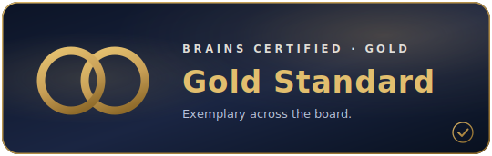

# BRAINS Certified — registry

Repositories that meet the [BRAINS standard floor](README.md) and carry the **Gold** mark.

  

| Repository | Owner | Tier | Certified | Evidence |
|---|---|---|---|---|
| [BRAINS-build-platform](https://github.com/shard-BRAINS/BRAINS-build-platform) | shard-BRAINS | 🥇 Gold | 2026-06-04 | [passing checks](https://github.com/shard-BRAINS/BRAINS-build-platform/actions?query=branch%3Amain) |

## Get listed

Meet the standard, then open a [certification request](../../issues/new?template=certification-request.yml). A maintainer verifies the evidence and adds your row. The bar: every standard check passes on your default branch, and the ND-affirming governance files are present.
